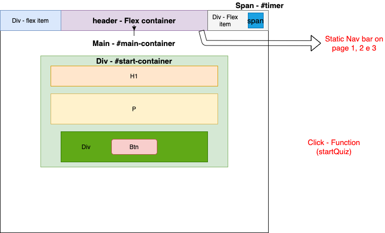
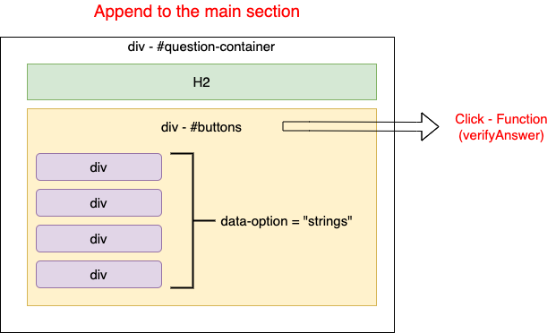
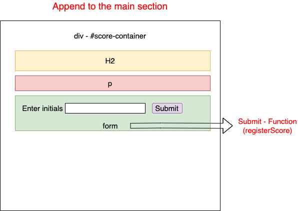
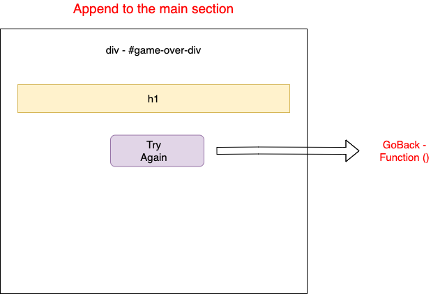
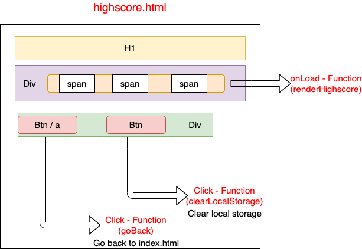
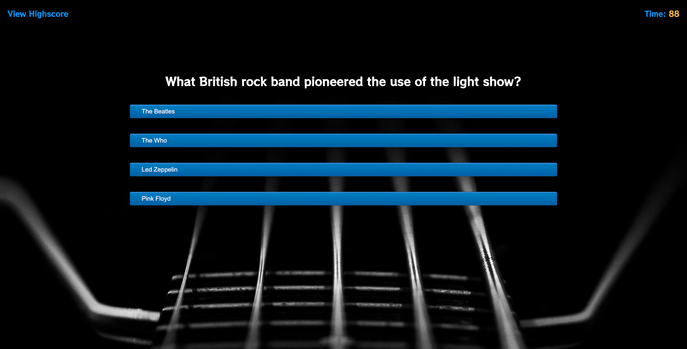
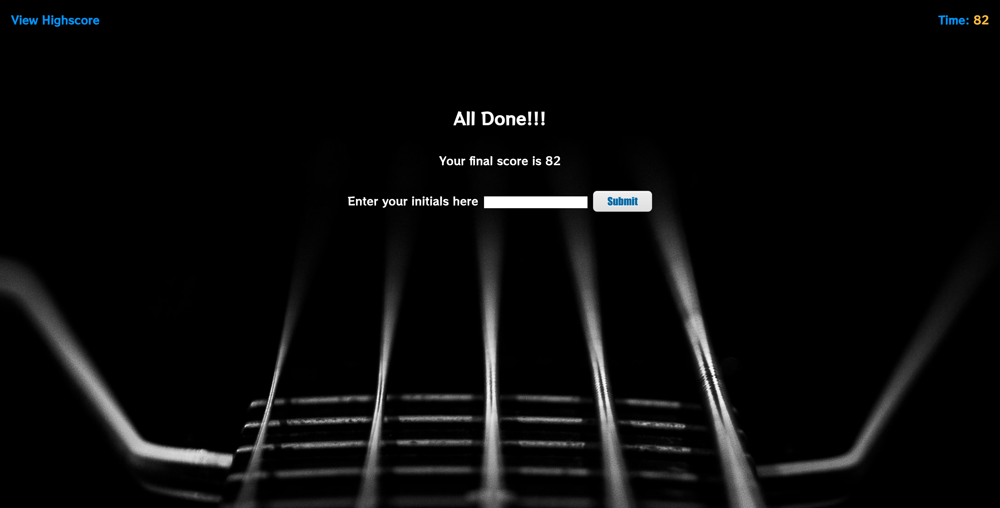
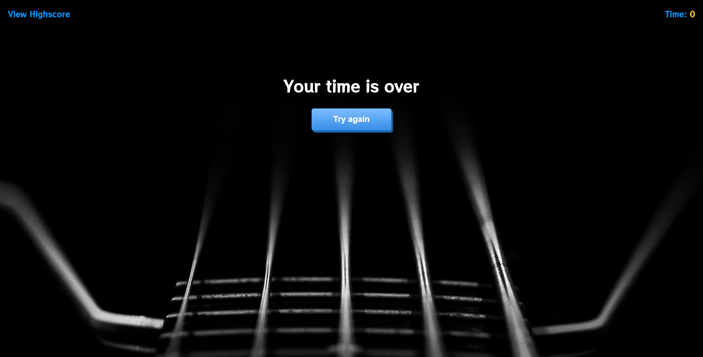
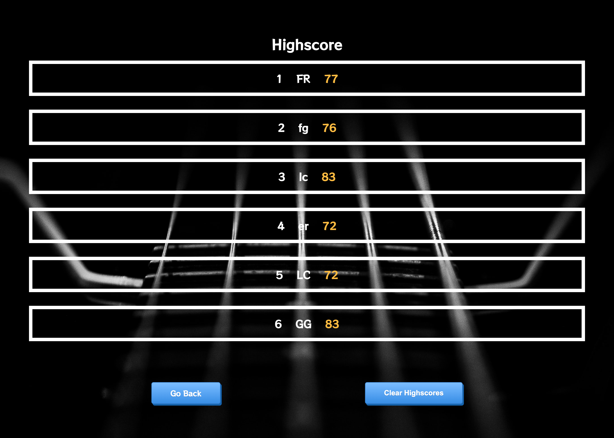

# timed-quiz-game

A clean, polished, and responsive timed coding quiz with multiple-choice questions that runs in the browser and will feature dynamically updated HTML and CSS powered by JavaScript code.

# The Rock n' Roll Quiz

## Description

This is a flat and responsive Rock n' Roll timed quiz. The page includes both multiple-choice questions and interactive Rock n' Roll challenges. Also presents a Highscore with all the players scores. All designed and coded by Luiz Froes.

## Deployed URL

You can view the GitHub pages deployed application [here](https://luizfroes.github.io/timed-quiz-game/)

## Technologies Used

- HTML5
- CSS
- Font Awesome
- JavaScript

## Screenshots

### Layout Designs

### Final Website

